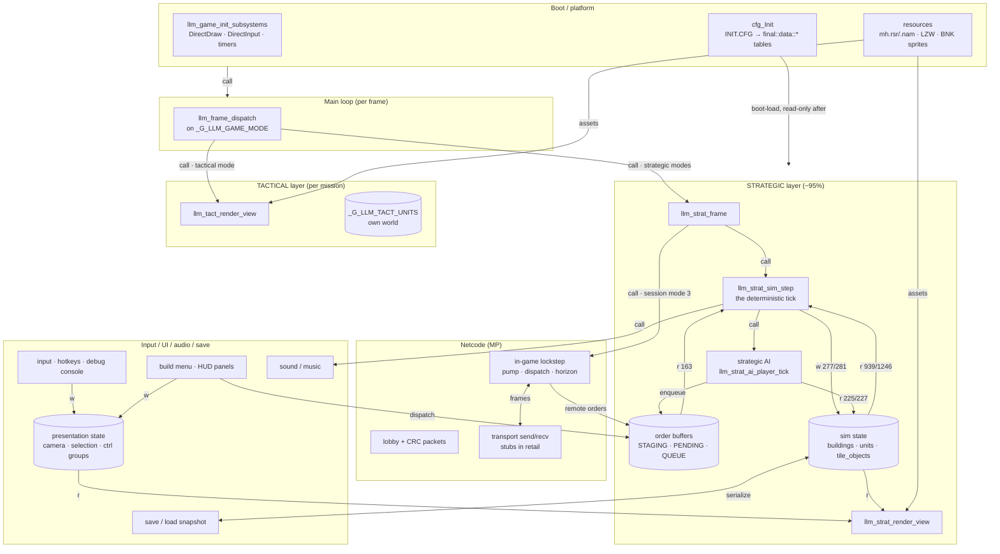
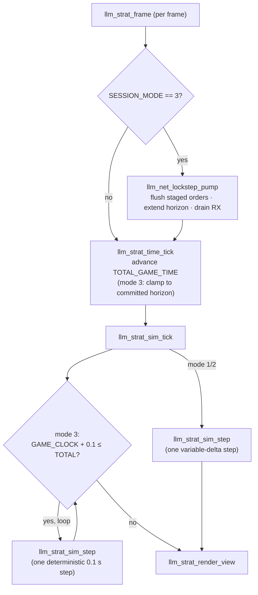

# Architecture — how mh.exe works

A high-level map of the game's runtime: the major subsystems, the main loop, and how state and
commands flow between them. This is the **orientation layer** — each box here has a deep-dive doc
linked inline; when this doc and a subsystem doc disagree, the subsystem doc (and the Ghidra DB)
win. Symbols named by the AI carry `llm_` / `_G_LLM_` prefixes (see [conventions.md](conventions.md)).

**Rewritten 2026-07-26 over a measurement.** Every state-flow edge below is backed by a row in the
generated state matrix (machine form `tmp/state_matrix.json`), which counts
read and write *sites* per (state region × function) across `DGROUP` + `.bss`; the adjudication of
what those rows mean is a separate per-site adjudication. Call-flow edges — which the matrix does not
measure — are **labelled `call`** and come from the call-graph closure. Earlier revisions of this
file drew edges from reading rather than measuring; where the two disagreed, the measurement won and
the correction is noted inline.

**The binary.** `mh.exe` is *Exterminacja / Mission Humanity* (Techland, ~2001) — a 32-bit x86
**Watcom C++** PE (`x86:LE:32:watcomcpp`, default `__watcall`), fixed image base `0x00400000` (no
ASLR), ~12.6 MB mostly zero-`.bss` where the big state arrays live. It is a **turn-of-the-millennium
RTS with two nested game modes**: a planetary **strategic** layer (≈95% of gameplay and of the
reverse-engineered code) and, occasionally, a **tactical** squad mission.

## The subsystem map

Edge weights are measured site counts (`w`/`r` = write/read sites, buildings/units). `call` edges are
call-graph, not state-flow.

## Two axes of "mode"

The runtime is controlled by **two** independent mode globals — don't conflate them:

- **`_G_LLM_GAME_MODE`** — *which screen/layer* is active (menu, strategic planet view, tactical
  mission, cutscene…). The per-frame `llm_frame_dispatch` switches on it.
- **`_G_LLM_GAME_SESSION_MODE`** — *how the strategic sim is paced*: `1` = single-player campaign,
  `2` = MP with <2 players (variable wall-clock delta), **`3` = MP lockstep** (fixed 0.1 s step,
  network-gated). Set at session start by `llm_strat_planet_session_begin` (SP) /
  `llm_strat_session_begin_multi` (MP, by player count). This is the axis that matters for
  determinism and multiplayer.

## The strategic frame — the heartbeat

Every strategic frame runs time → sim → render. In lockstep (mode 3) a **network pump** runs first
and the frame can stall until the lockstep horizon advances.

**`llm_strat_sim_step`** (`0x0043f512`) is the deterministic unit of simulation — the thing MP
lockstep re-runs identically on every peer. In one step it: releases due orders
(`order_release_due`), runs the AI (`llm_strat_ai_players_tick`), dispatches the order queue
(`llm_strat_order_queue_dispatch`), then per active player does economy roll-over + sub-ticks, walks
every unit (`llm_strat_unit_tick`) and building (`llm_strat_building_tick`), and ticks the projectile
pool and fx animations.

Note `llm_strat_time_tick` is driven by **`llm_strat_frame`, not by the sim step** — it is the only
place a wall clock enters, and it stays outside the deterministic path below.

## The deterministic hot path (measured 2026-07-26)

For any "can this desync?" question, the useful unit is not a subsystem but the **hot path**: the
call closure of `llm_strat_sim_step` **cut at every edge into a UI/render function**. Measured:

- Naive closure: **946** functions — which swallows the entire UI/menu/render world, because player
  elimination *inside* the sim step opens the outcome dialog and redraws:
  `sim_step → order_queue_dispatch → bldg_scrap_stored_units → unit_teardown →
  player_presence_lost → ui_outcome_dialog → ui_menu_bg_redraw_cb → strat_render_view`.
  That path is real and made entirely of direct calls.
- **Cut at the boundary: 686 functions**, and the sim→UI/render interface is **65 distinct call
  edges** — small enough to enumerate, which makes it a usable seam list.
- Artifact: `tmp/sim_hotpath.json`. Ask determinism questions against *this set*, not against name
  prefixes.

**On the hot path there is no *wall* clock and no non-deterministic RNG.** `rand`/`srand`/
`GetTickCount` have no caller anywhere inside the cut; `GetCurrentTime`'s callers
(`llm_strat_time_tick`, `llm_strat_time_resync_and_tick`) sit outside the cut; and
`llm_game_clock_tick_update` — the one function that reads a cached tick value
(`_G_LLM_INPUT_TIME_EPOCH`) — is likewise off the hot path.

> **CORRECTED 2026-08-24 (`TACT-REC`), and the correction is about SCOPE, not the conclusion.** This
> paragraph used to say those three "do not exist in the binary at all". They do: `llm_rand`
> (`0x004da98b`) is Watcom `rand()` — the tactical probe had already established that — and **`GetTickCount`
> has NINE call sites**: `llm_input_wndproc_tap` ×5 and the game-clock family
> (`llm_game_clock_tick_update`, `_pause`, `_resume`, `_reset`). None is inside the strategic cut, so
> the paragraph's *conclusion* stands for the strategic sim and nothing about `RI-SIM` changes.
> **What the absolute wording was hiding is TACTICAL.** `[harness] pin_wallclock` whole-body-replaces
> `GetCurrentTime` (`0x00427616`) and **nothing pins `GetTickCount`**, so a claim that it "does not
> exist" is exactly the sentence that stops someone checking whether a tactical run has an unpinned
> real-time input. It does have one: tactical mode reads `GetTickCount` and nothing pins it.

The distinction matters, because the hot path *does* read time constantly: **29 hot-path functions
read `_G_LLM_STRAT_GAME_CLOCK`, and none of them writes it.** That is the deterministic **sim** clock
— advanced in fixed steps by `llm_strat_time_tick` outside the step and then treated as read-only
input within it — plus the fixed `_G_LLM_STRAT_SUBTICK_*_PERIOD` and `_G_LLM_STRAT_TICK_BUDGET`
constants. Reading the sim clock is by design; reading a *wall* clock would be the defect.

## The command bus — one order pipeline for player, AI & remote

Player clicks, AI decisions, and remote-peer orders **all** become the same 0x44-byte
`llm_strat_order` and are executed from one `_G_LLM_STRAT_ORDER_QUEUE[300]`. Two lanes: an
*immediate* lane (SP + AI, straight to the queue) and a *scheduled* lockstep lane (MP human orders,
delayed to a synced future tick and broadcast). AI orders are **recomputed identically per peer**, so
only human input crosses the wire. That split — immediate versus scheduled — IS the order
pipeline.

**The measurement confirms the design exactly** — and confirms the buffers are a closed island (only
sim-layer code reads *or* writes them, so nothing else can perturb the command stream):

| function | STAGING | PENDING | QUEUE |
| --- | --- | --- | --- |
| `llm_strat_order_enqueue` | | | **w 5** |
| `llm_strat_order_stage_scheduled` | **w 7** | | |
| `llm_strat_order_schedule` | w 2 / r 6 | **w 5** / r 4 | |
| `llm_strat_order_release_due` | | r 12 / w 1 | **w 2** / r 7 |
| `llm_strat_order_queue_dispatch` | | | w 2 / **r 132** |
| `llm_strat_order_queue_apply_and_dequeue` | | | w 1 / r 20 |

Record moves between buffers are Watcom `LEA`+`MOVSD.REP` block copies, which is why a naive scan
reports them as "address-taken" rather than writes -- a block copy is not an address escape.

## Game state — who owns what

The "game state" is a set of large fixed static arrays in `.bss` (this is also why raising caps is a
relocation problem — moving one array means rewriting every reference site). Write/read counts are **measured
site counts by architectural layer**:

| state | global | shape | written by | read by |
| --- | --- | --- | --- | --- |
| buildings roster | `map::g::buildings` `0xc3d2a0` | `[8][100]`, 218 400 B | sim 277 · boot 35 · **ai 3** | sim 939 · ai 225 · ui 57 |
| strategic units | `map::units` `0xdd8c48` | `[8][100]`, 186 400 B | sim 281 · **ai 42** · boot 33 | sim 1246 · ai 227 · ui 20 |
| per-player AI/econ store | `game_player_data` `0xe6dec0` | `[8]`, 1 329 120 B | **ai 284** · sim 157 | **ai 1122** · sim 60 |
| player profiles | `_G_LLM_STRAT_PLAYERS` `0xcff060` | `llm_strat_player_profile[8]`, 14 848 B | sim 60 · **net 36** · boot 5 | sim 97 · net 70 · boot 48 · ui 27 |
| map occupancy | `tile_objects` `0xd1ec80` | 524 288 B | sim 83 · boot 4 | sim 287 · ai 26 |
| planets | `cfg::final::data::Planets` `0xbe6da0` | `[32]`, 34 016 B | **boot 53** · ui 8 · sim 2 | sim 46 · boot 22 |
| projectiles | `_G_LLM_STRAT_PROJECTILE_POOL` `0xe1db98` | `[1500]`, 181 500 B | sim 37 | sim 35 |
| order buffers | STAGING `0xbca920` / PENDING `0xbb9e80` / QUEUE `0xbb4ed0` | `[300]/[1000]/[300]` | sim only | sim only |
| RNG / clock | `_G_LLM_STRAT_RNG_STATE` `0x603ecc` / `_G_LLM_STRAT_GAME_CLOCK` `0x5d0198` | `uint[4]` / `double` | sim · boot | sim 184 · net 6 · ui 4 |

Corrections this measurement forced on earlier revisions of this file:

- **`game_player_data` is `[8]`, not `[2]`** (corrected 2026-07-27, D11). The Ghidra type said `[2]`
  and this table repeated it. The extent comes from the indexing: `llm_game_land_players_on_planet`
  (`0x45534e`) loops `idx = 0..7` (`CMP [EBP-0x18],8` at `0x45539d`) calling
  `llm_strat_init_human_player_data(idx)` / `llm_strat_spawn_ai_base(idx)`, each of which indexes
  `player_data[idx]` and raises `_G_LLM_STRAT_AI_ACTIVE_PLAYER_COUNT` to `idx+1`;
  `llm_strat_ai_players_tick` then iterates `0..COUNT-1`. Space agrees — `[8]` ends at `0xfb26a0`, the
  next defined object is `0xfb26b0`, nothing in between. The under-typing hid **~973 KB** of per-player
  AI/econ store from the MP determinism harness, which is harmless while both peers are humans in slots
  0/1 and is not once an AI takes slot ≥ 2 (open MP oracle items D10/D11).
- **`game_player_data` is the AI's store, not "player economy/profile".** It is AI-dominated by an
  order of magnitude (ai 1122 reads vs sim 60) — timers, build plans, `ai_groups[32]`, building
  queues, scores. The player-facing profile is `_G_LLM_STRAT_PLAYERS`.
- **`units` is at `0xdd8c48`**, not `~0xdd8c4a`.
- **The AI writes the rosters directly** (units 42 sites, buildings 3) rather than issuing orders for
  every mutation — a real architecture violation, though not a desync since AI is recomputed
  identically per peer. Tracked as an RI-AI reimplementation item.
- **`Planets` is effectively a config table** — boot writes it 53 times, the sim twice.

### Three state islands, not one

- **Sim state** — the rosters above. Replicated, hashed, lockstep-critical.
- **AI state** — `game_player_data` plus the `_G_LLM_STRAT_GROUP_*` / `_G_LLM_STRAT_PATH_JOB_*`
  scratch. Written only by AI; recomputed identically per peer.
- **Presentation state** — camera, selection, panel mode/page, and **control groups**
  (`_G_LLM_STRAT_CTRL_GROUPS`, `llm_strat_ctrl_group[10]` — ten groups, *not* per-player, so it is
  local-player-only). Read by both UI *and* render, so it is not UI-internal. **The sim must never
  read it**: a sim decision branching on presentation state is a silent desync. Currently it does
  read it in a few places, each one adjudicated benign at the site.

Tactical mode uses a separate world (`_G_LLM_TACT_UNITS`, 196 596 B, its own island).

## Determinism

The strategic sim replays bit-identically: two seed-injected fixed-timestep replays produce the same
game-state hash at every step, through real combat, and **cross-vendor (Intel vs AMD) replays are
bit-identical over 2000 steps** (2026-07-09) — the earlier x87-FP risk is closed. It was *built* for
lockstep: a segregated deterministic PRNG, fixed step, index-ordered loops.

**Three PRNG channels, not two** (corrected 2026-07-26 — all three seeded by
`llm_strat_rng_seed_channel`, all three used on the hot path):

| channel | entry point | used by |
| --- | --- | --- |
| **0** — strategic | `llm_rand_below` → `llm_strat_rng_next(0)` | sim decisions |
| **1** — fx / cosmetic | `llm_rand_below_fx` → `llm_strat_rng_next(1)` | effects |
| **2** — **AI** | `llm_rand_below_ai` → `llm_rand_prng_tick_slot(2)`, `llm_rand_state_advance(2)` | AI scatter / wander / target pick |

`_G_LLM_STRAT_RNG_STATE` is `uint[4]` (16 B) — **not** the `[16]` earlier revisions claimed. Slot N
lives at `0x603ecc + 4N` (every entry point indexes `[slot*4 + 0x603ecc]`); **slot 3 is unreachable** —
no call site anywhere supplies it, and every site passes the slot as a `push imm8` constant. The
`fdiv qword ptr [0x603f0c]` in `llm_rand_state_advance` is the 65535.0 divisor constant
(`_G_LLM_STRAT_RNG_NORM_DIVISOR`), not state.

> **The determinism oracle was narrower than it looked — widened 2026-07-27.** The harness hashed 20
> regions with `map::units` **not** among them, and excluded `rng_state` wholesale as "the strategic
> PRNG channel" though the region also holds the **AI** channel. Both are now fixed: `units`,
> `tile_objects` and `soldiers` are hashed (D1), and `rng_state` is hashed with only the **fx** slot
> masked, so slots 0 and 2 count toward the verdict (D3). Two masks and two exclusions remain, each
> with a measured reason: `ctrl_group_id` (local-player byte in a replicated record, D2), the fx PRNG
> slot, and `p0/p1_ai_econ` + `order_pending` — each with the runs behind it recorded.
> The open oracle items are tracked with the MP work.

## Netcode & multiplayer

Two layers sit under a fully-implemented protocol:

- **Lobby** — host/client match formation, CRC-checked packets, map streaming, slot management.
- **In-game lockstep** — the pump/dispatch/horizon machinery that paces the mode-3 sim against a
  committed horizon (`= min` over peers). Implemented in retail; only the two **transport
  primitives** (`llm_net_transport_send` `0x0049b635`, `llm_net_transport_recv` `0x0049b65b`) are
  empty stubs — **the seam the project's injected DLL fills**, giving working LAN multiplayer today.
- The **working ancestor** of this dead code is *Extermination*'s `net_udp.dll` (UDP port 1500,
  reliable ARQ), reverse-engineered end to end as this project's cross-version reference.

**Netcode reaches into sim state directly rather than purely through orders**, and a field-level trace
(field-level, not site-level) shows the coupling is deeper than the site count suggests. Net's
*direct* writes are a clean 3-bit subset of `_G_LLM_STRAT_PLAYERS[].status_flags` (b2 human / b3 AI /
b4 dropped, always as one atomic triple). But all three drop handlers then call
`llm_strat_player_presence_lost` (`0x498089`, on the hot path), which clears **b1 `alive`** — the bit
`llm_strat_sim_step` gates its master per-player loop on (`0x43f580`), that `llm_strat_order_release_due`
skips players by, that the AI tick chain gates on, and that
`llm_strat_bldg_compute_state_checksum` folds into the lockstep checksum (`0x4a0125`) — though that
call is **conditional** on `count_active_players() < 2` (the game-over path), so an ordinary
3+-survivor drop flips only b2/b3/b4.

**Retail is nonetheless ordered — by a barrier, not by the order stream.** The removal is applied
local-immediately and on arrival, never scheduled; what makes it safe is that a silent peer's
`PEER_HORIZON` freezes, `llm_net_lockstep_commit_horizon` (`0x49c189`) mins over it, and
`llm_strat_time_tick` clamps the sim clock to the result — so every peer is *parked at the dead peer's
last horizon* when the leader-gated drop fires, with a receiver-side fail-stop on horizon mismatch.
The coupling is therefore latent in retail. **Our injected `graceful_drop` default removes that
precondition** by firing the same function on transport-death instead of while parked (MP D5). This is
why RI-LOCKSTEP must turn peer-drop into an ordered order rather than a direct write: the current
safety is emergent and easy to break from outside.

## Data & configuration

The game is heavily **data-driven**; behaviour tables are loaded at boot and read (never written) by
the sim — a property the matrix confirms (the `cfg::final::data::*` tables measure as boot-written,
sim-read).

- **Config** — `cfg_Init` parses `init\INIT.CFG` (UTF-16 LE, 131-keyword grammar) into the
  `cfg::final::data::*` tables (`Unit`, `Planet`, `Anim`, `System`, weapon/`fx_type` tables, text
  pointers). The grammar is transcribed in `src/formats/cfgkit`, which also carries the moddable
  YAML toolchain.
- **Resources** — `mh.rsr` + `mh.nam` (offset-index) packs, LZW-compressed, holding `BNK` sprite
  banks, maps, and biome tilesets. Sprite format: [BNK_FORMAT.md](../BNK_FORMAT.md); the map,
  mission and tileset binaries are decoded by `src/formats/mapkit`, and AI tuning is read out of
  the game's own `AI.SCR`.
- **Save/load** — a savegame is the full sim-state snapshot; loading restores the clock and state
  (but **not** the RNG — matters only for MP save/load). Config is baked into saves.

## Rendering & audio

- **Strategic** planet view: `llm_strat_render_view` + the per-tile object dispatcher
  under it, drawing sprites via the two RLE blitters (palettized +
  raw-16bpp) with fog-of-war stencils.
- **Tactical** scene: `llm_tact_render_view`.
- **Input**: DirectInput keystate + event-ring; a hidden SHIFT+ENTER debug/cheat console.
- **Audio**: distance-attenuated strategic sound/FX; music via CD/streamed. Reached from the sim via
  `llm_snd_play` — one of the 65 sim→presentation boundary edges.

## The modding / intervention layer

Not part of the original game — the project's own tooling that operates *on* the above:

- **Injected DLL** (`src/mh_dll`) — `mh.dll` force-loaded via added-import surgery; hosts relocated
  pools, the restored MP transport/lobby/lockstep seams, the determinism harness, the debug overlay
  and the UI-test harness. [`src/mh_dll/README.md`](../src/mh_dll/README.md).
- **Limit raises** — relocate a static state array into a new section/DLL region and rewrite every
  ref site. The in-memory variant is [inmem-patching.md](inmem-patching.md); the declarative
  patch pipeline is `src/patcher/`.
- **cfgkit / mapkit** — edit config and maps as YAML / Tiled and recompile byte-faithfully
  (`src/formats/cfgkit`, `src/formats/mapkit`).
- **Reimplementation (M6)** — the strangler-fig replacement of the deterministic spine; this
  document's state-ownership tables are that plan's Law-1/Law-2 input.
- Cross-version references: the English build (four functions have genuinely different codegen)
  and *Extermination*, whose `net_udp.dll` is the working ancestor of this game's wire format.

---
*Index doc — kept high-level on purpose. Follow the links for mechanics, structs, and addresses.
Symbol tables: [symbols.md](symbols.md) · struct layouts: [structs.md](structs.md).*
